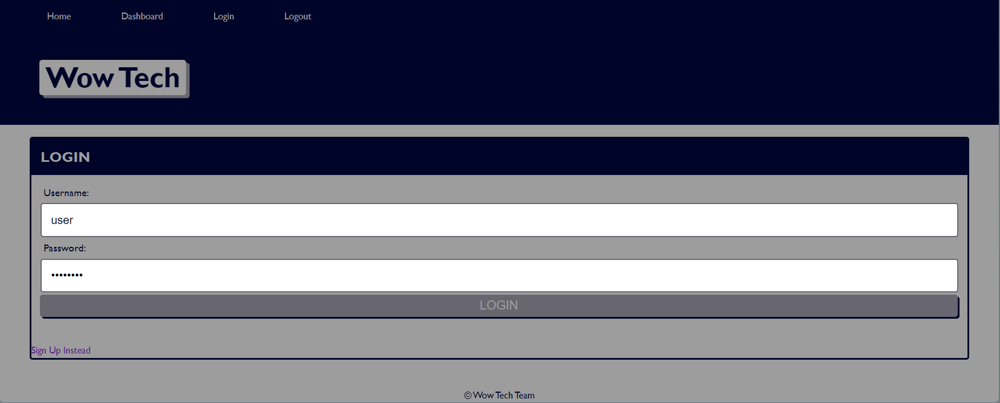

# wow-tech

## Deployed Webpage

[Link to webpage](https://wowtechblog.herokuapp.com/)

## Description 

The main goal of this project is to create a technology blog from scratch. Users are able to publish their own blog posts, and comment on others' posts as well. This website follows the MVC paradigm in its architectural structure with Handlebars.js as the templating language. 

## Usage

Once the website opens up, users are able to see the home page which is populated with previous posts. To create any sort of action on the website, users must login or signup. Users can create a new post, and comment on others' posts as well. 

## Technologies Used

* JavaScript
    * Express.js: Sequelize, dotenv, bcrypt, express-session, connect-session-sequelize
    * Express-Handlebars
* MySQL
* Insomnia Core

## Installation

1. Create a new repository on Github. 
    - Press the "+" sign on the top right hand corner, or the "new" button on your GitHub homepage. 
    - Create an unique name for your repository, and make the respository public. 
    - Click the "README" option to include the "README" page. 
    - Your new repository has been created.
2. Open GitBash (PC users) or Terminal (Mac users).
    - Navigate to where you want to clone your new repository onto your local machine. 
        - Use `cd` to help you navigate. 
3. To clone the new repository onto your local machine. 
    - Click the respository that you just made on github.com.
    - Click the "code" button and choose the SSH option. 
    - Copy the SSH option to your clipboard. 
    - On GitBash/Terminal, enter the command `git clone git@github.com:<UserNAME>/<demo-repo>.git`
        - After `git clone`, paste the SSH option from your clipboard into GitBash/Terminal.
        - Since the SSH option was used, enter the password for the SSH key when asked. 
4. You have now cloned your new repository.
    - Using `cd`, navigate into your new repository from the location that you have saved it in. 
    - Use `ls` to see what is inside the new repository currently. 
        - It should only include the README page as of now.
5. Tranferring the project files into your new directory on your local machine. 
    - Using Finder/Explorer, copy the corresponding files that are needed to edit your project. 
    - In another Finder/Explorer window, navigate to your new repository, and paste the files directly into that folder. 
6. On GitBash/Terminal, after pasting the project files into the new repository. 
    - Use `ls` to see what is now inside the new repository.
        - This should now include the README page, and the project files that you have copy-pasted in. 
7. Use `git status` to see if there any changes that need to be made to the repository. 
    - At this point, git will tell you that there is an untracked file .
8. Use `git add .` to add the new project files, and allow the new files to be tracked by git.
9. Use `git commit -m "add base project files"` to commit the changes have recently been made to the repository. 
10. Use `git push origin main` to sync your local machine with GitHub. 
    - Enter your SSH password when prompted. 
11. Use `code .` to open the files on a code reader of your choice.
12. Edit the files as necessary in your code reader. 
13. Periodically, and when you are finished with editing your code: 
    - Follow Steps 7-10 to keep your repository up to date with the changes that have been made. 
14. This requires Terminal to start the server. 
    * Run `npm install`.
    * Enter `mysql -u root -p` to start MySQL. Enter password when prompted.
    * Enter `source schema.sql` to create the database
    * To seed the database: `npm run seed`
    * To start the server: `npm start` 
15. You have successfully completed this project!

## Credits

Initial prompt given by UC Berkeley Extension, Coding Bootcamp. 

## Reflection

This project required the understanding of many different concepts. Express.js is useful in creating the different routers to establish the different API routes. MySQL is used here to create the initial database. Sequelize is used to establish a connection to the server and create models. The use of the .env file helps protect any passwords that are used to establish that connection. The hardest part of this project was writing the differrent routes and creating the handlebars. This project stands out because it cannot make it past the login and signup page. I believe there is an error in my connecting the database to the server, and I simply could not get it to work on the deployed page. 
## License

Licensed under the [MIT](https://choosealicense.com/licenses/mit/#) license. 

## Contributors

Feel free to reach out to me at the following: 
* [LinkedIn](https://www.linkedin.com/in/snehita-kolli-0abb23b1/) || [GitHub](https://github.com/snehitak20)
